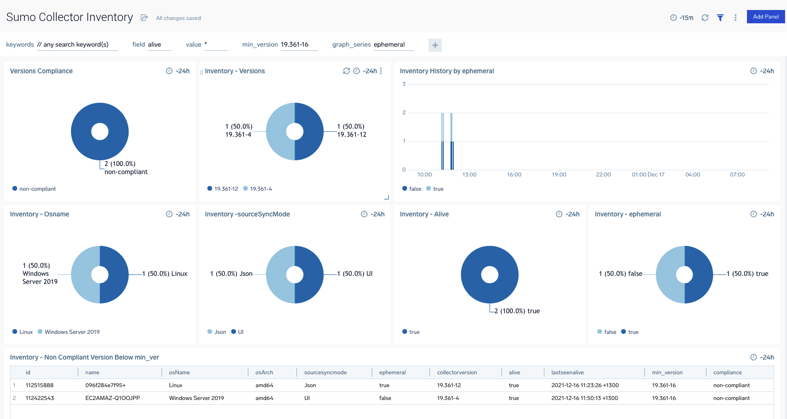

# sumo-agent-inventory
runs python management client to listVersions or listOfflineCollectors and posts output to a sumo instance.


- exports json formatted collectors to local file such as inentory.txt in json format 
- then posts this to the HTTPS sumo endpoint you specify.

## Dashboard
In the examples folder you will find an inventory dashboard you can import. 


./examples/inventory-dash.json

# Querying collected data
You can parse the json easily to report in sumo for example:

## Alive Collectors less than security recommended 19.361-12
```
_source="agent_inventory" _sourcecategory=sumo/inventory/agents 	// any search keyword(s)
| parse regex "(?<json_collector>\{.+\})" 
| json field=json_collector "id"
| json field=json_collector "name"
| json field=json_collector "fields"
| json field=json_collector "ephemeral"
| json field=json_collector "osName"
| json field=json_collector "osArch"
| json field=json_collector "lastSeenAlive"
| json field=json_collector "alive"
| json field=json_collector "collectorVersion"
| json field=json_collector "sourceSyncMode"
| where alive matches "*"
| first(sourcesyncmode) as sourcesyncmode,first(ephemeral) as ephemeral,first(collectorversion) as collectorversion,first(alive) as alive,max(lastseenalive) as lastseenalive, count by id, name,osname,osarch 
| "19.361-16" as min_version
| parse field =min_version "*.*-*" as major1,minor1,patch1
| parse field =collectorVersion "*.*-*" as major,minor,patch 
| if( major >= major1 and  num(minor) >= num(minor1)  and num(patch) >= num(patch1),"compliant","non-compliant") as compliance
| where compliance="non-compliant" | fields -_some_matched,major,major1,minor,minor1,patch,patch1,_count
| sort name asc

| formatdate(tolong(lastseenalive),"yyyy-MM-dd HH:mm:ss ZZZZ") as lastseenalive 

```

## the modified sumo_mgmt.py
this is a slightly modified version of https://github.com/SumoLogic/collector-management-client#listing-versions but it has an added -output argument to print a table or compressed json format.

You can trigger the json output like this instead of orgional table format
```
python sumo_mgmt.py -url='https://api.us2.sumologic.com/api/v1/' -accessid=$SUMO_ID_DEMO -accesskey=$SUMO_KEY_DEMO -listOfflineCollectors=1 -output=json
```

# Setup To Run Inventory or Offline Scripts
## 1. setup HTTPS Endpoint
create a https source in sumo with single line format and use timestamp parsing disabled so will default to now.

```
{
    "api.version":"v1",
    "source":{
      "name":"agent_inventory",
      "category":"sumo/inventory/agents",
      "automaticDateParsing":false,
      "multilineProcessingEnabled":false,
      "useAutolineMatching":false,
      "forceTimeZone":false,
      "filters":[],
      "cutoffTimestamp":0,
      "encoding":"UTF-8",
      "fields":{
        
      },
      "messagePerRequest":false,
      "sourceType":"HTTP"
    }
  }
```

## 2. Set environment variables
create env vars:
-SUMO_ACCESS_ID: access id for your org
-SUMO_ACCESS_KEY: access key for your org
-SUMO_ENDPOINT: your api endpoint in format: https://api.us2.sumologic.net/api/v1/
-SUMO_HTTPS: https endpoint you created above.

- SUMO_POST defaults to true. if false will not post a file to sumo only writing to local file
- SUMO_FILTER default null. Set to say name=prod* to activate the -filter parameter for listversions etc

## 3. to executing scripts
### ./inventory.sh
output to inventory.txt

it will execute a modified version of sumo_mgmt.py that exports each collector and posts to the https endpoint as a log line in this format:
```
2021-12-16 11:10:29,507 -1100 [INFO] {"id": 112422543, "name": "EC2AMAZ-Q1OOJPP", "timeZone": "Etc/UTC", "fields": {}, "links": [{"rel": "sources", "href": "/v1/collectors/112422543/sources"}], "ephemeral": false, "targetCpu": -1, "sourceSyncMode": "UI", "installedCollectorSubtype": "Installed", "collectorType": "Installable", "collectorVersion": "19.361-4", "osVersion": "10.0", "osName": "Windows Server 2019", "osArch": "amd64", "lastSeenAlive": 1639605854387, "alive": true}
```

### ./offline.sh
output to offline.txt.

similar to above but for the listofflinecollectors exports to offline.txt
- SUMO_OFFLINE_DAYS - days param for offline days cutoff

# docker 
A docker image to execute the python in it's own environment.
```
docker run -it -e SUMO_ACCESS_ID=$SUMO_ACCESS_ID -e SUMO_ACCESS_KEY=$SUMO_ACCESS_KEY -e SUMO_ENDPOINT=https://api.us2.sumologic.net/api/v1/ -e SUMO_HTTPS=$SUMO_HTTPS sumoagentinventory
```

